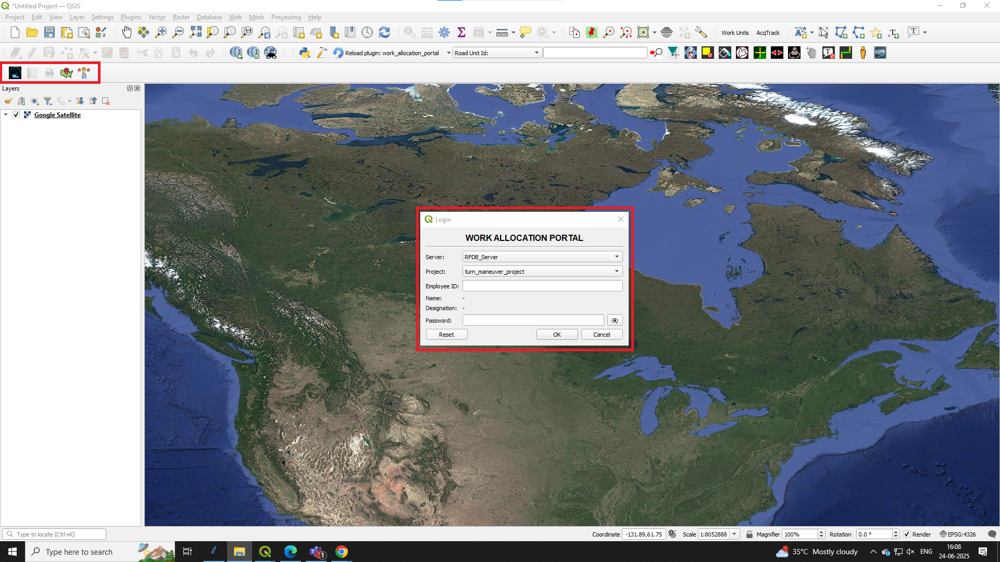
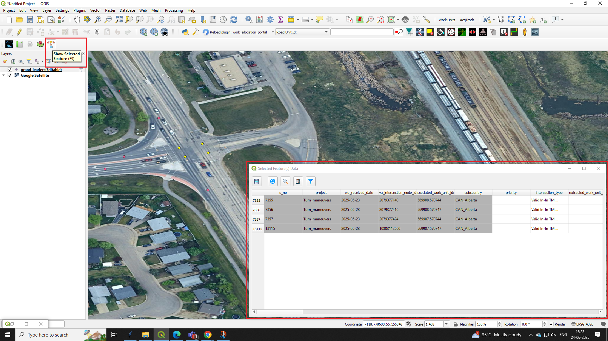

# Work Allocation Portal QGIS Plugin

The **Work Allocation Portal** is a custom QGIS plugin designed to streamline team-based GIS workflows through a dynamic table-based editor. It mimics Google Sheets behavior while providing advanced control over attribute editing, data validation, and role-based permissions using a PostgreSQL backend.

## 🔧 Features

- ✅ **Inline Editing** without QGIS edit mode
- ✅ **Role-Based Field-Level Permissions** (Admin/Staff/Leader roles)
- ✅ **Google Sheet-style Table Widget** using QtPySheet
- ✅ **Undo/Redo and Group Paste Tracking**
- ✅ **Column Organizing, Filtering, Zoom to Feature**
- ✅ **Auto-population of fields based on rules (e.g., Emp ID → Name)**
- ✅ **Login with Google Sheets-based credentials**
- ✅ **Works with PostgreSQL and Materialized Views**

## 🛠️ Installation

1. Clone or download this repo.
2. Copy the `work_allocation_portal` folder into your QGIS plugins directory:
   - On Windows:  
     `C:\Users\<YourUsername>\AppData\Roaming\QGIS\QGIS3\profiles\default\python\plugins`
3. Open QGIS → **Plugins** → **Manage and Install Plugins**
4. Enable **Work Allocation Portal**

## 🧩 Dependencies

- QGIS 3.22+
- PostgreSQL (tested with PostGIS-enabled setup)
- Python packages:
  - `PyQt5`
  - `pandas`
  - `psycopg2`
  - `qt_pysheet` (custom sheet-like widget)
  - `pyperclip` *(optional, for clipboard)*

> You may need to install dependencies via `pip install` if you test outside QGIS.

## 🔐 Login System

- Credentials fetched from Google Sheets
- Role-based UI:  
  - **Admins** can edit selected columns  
  - **Staff** has read-only access via materialized view
- Dropdown to select active project

## 📋 Screenshots

- Login Panel
  

- Select state

- Show selected feature(s)

- Work Allocation Portal Viewer/Editor

.png)

- Zoom to feature

- Organize columns

## 💡 Future Improvements

- QTableView and QAbstractProxyModel for large data optimization
- Color-coded status fields
- Upload CSV to upload inputs
